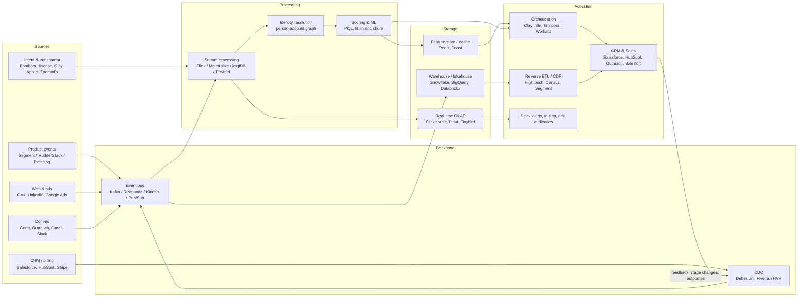

# GTM Engineering: Tech Stack Connected with Real-Time Data Processing

## Core idea
Every buyer signal (product event, web visit, intent spike, CRM change) flows through one event backbone, is identity-resolved and enriched in-stream, scored, and routed to an action in seconds, not on a nightly batch.

## Architecture

## Layers and tool choices

| Layer | Purpose | Common tools | Latency |
|---|---|---|---|
| Collection | Capture behavioral and system events | Segment, RudderStack, PostHog, Snowplow, webhooks | ms |
| Backbone | Durable, replayable event log | Kafka, Redpanda, Kinesis, Pub/Sub; Debezium for CDC | ms |
| Stream processing | Enrich, dedupe, window, join | Flink, Materialize, ksqlDB, Tinybird, Spark Structured Streaming | sub-second to seconds |
| Identity | Resolve user, account, device, domain | Segment Unify, RudderStack Profiles, custom graph, Clearbit/Clay | seconds |
| Enrichment | Firmographics, technographics, intent | Clay, Apollo, ZoomInfo, 6sense, Bombora, BuiltWith | seconds |
| Storage | History plus fast reads | Snowflake/BigQuery/Databricks; ClickHouse/Pinot; Redis | s to min |
| Modeling | Scores, segments, attribution | dbt (incremental), Feast, in-stream ML | seconds to minutes |
| Activation | Push to where reps and campaigns act | Hightouch, Census, Clay, n8n, Temporal, Workato | seconds |
| Systems of action | Where humans and sequences run | Salesforce, HubSpot, Outreach, Salesloft, Slack, ad platforms | n/a |
| Observability | Trust the pipeline | Monte Carlo, Datadog, Great Expectations, OpenLineage | continuous |

## Example real-time plays
1. **Product-qualified lead:** a usage event hits the bus, Flink windows it (e.g. 5 invites in 24h), joins it with account fit, scores it, then creates a CRM task and a Slack alert in under 30s.
2. **High-intent visit:** a pricing-page visit is resolved to an account, enriched via Clay, checked against open opportunities, then routed to the owner or an SDR round-robin and a sequence is triggered.
3. **Churn risk:** usage drop plus support sentiment (Gong/Zendesk) feeds a score, and the CSM is alerted with context.
4. **Ad suppression/audiences:** closed-won and in-pipeline accounts are synced to LinkedIn and Google within minutes.

## Design principles
- **One event contract:** schema registry plus versioned events (Avro/Protobuf/JSON Schema).
- **Warehouse as source of truth, stream as speed layer:** write both, and reconcile with dbt.
- **Idempotent activation:** dedupe keys and upserts, so retries don't double-sequence a lead.
- **Loop closure:** CRM outcomes flow back into the bus to retrain scores.
- **Guardrails:** rate limits, consent/suppression checks (GDPR/CCPA), and a human-approval tier for high-impact actions.
- **Start small:** one signal, one play, one SLA (e.g. pricing-visit to rep alert under 60s), then add sources.

## Reference stack by company stage
- **Seed–Series A (lean):** PostHog or Segment → Clay + n8n → HubSpot + Slack; BigQuery or Snowflake for history.
- **Series B–C:** Segment/RudderStack → Kafka or Kinesis → Tinybird or Flink → Snowflake + Hightouch → Salesforce + Outreach; dbt, Monte Carlo.
- **Enterprise:** Kafka plus a schema registry, Flink, a lakehouse, a feature store, Temporal orchestration, and full lineage and governance.
